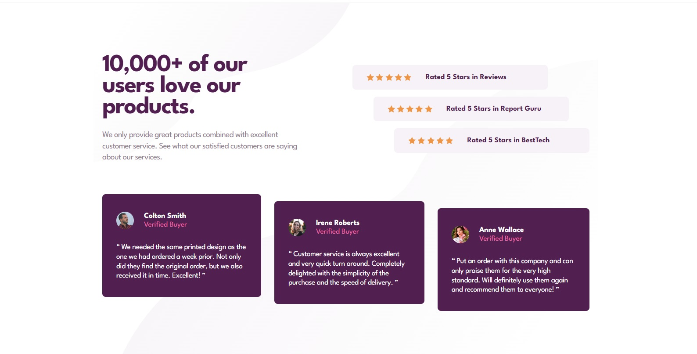

# Frontend Mentor - Social proof section solution

This is a solution to the [Social proof section challenge on Frontend Mentor](https://www.frontendmentor.io/challenges/social-proof-section-6e0qTv_bA). Frontend Mentor challenges help you improve your coding skills by building realistic projects. 

## Table of contents

- [Overview](#overview)
  - [The challenge](#the-challenge)
  - [Screenshot](#screenshot)
  - [Links](#links)
- [My process](#my-process)
  - [Built with](#built-with)
  - [What I learned](#what-i-learned)
  - [Continued development](#continued-development)
- [Author](#author)

## Overview

### The challenge

Users should be able to:

- View the optimal layout for the section depending on their device's screen size

### Screenshot

### Links

- Solution URL: [repo](https://github.com/Illia-L/social-proof-section)
- Live Site URL: [site](https://illia-l.github.io/social-proof-section/)

## My process

### Built with

- HTML
- CSS
- Flexbox

### What I learned

Trained using:
- css pseudo classes and pseudo elements
- mediaqueries
- icon sprites

### Continued development

Going to further practice CSS and JS

## Author

Illia Liashko
